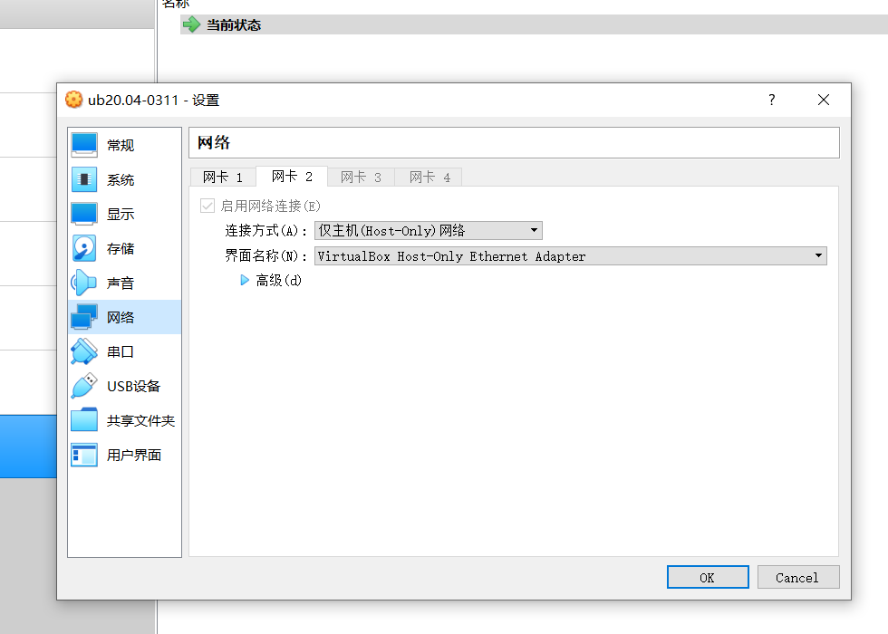

# 配置无人值守安装iso并在Virtualbox中完成自动化安装

## 实验目的

掌握ubuntu20.04版本无人值守安装iso文件的制作
掌握VirtualBox 虚拟机手动安装和无人值守安装的配置

## 实验环境

Virtualbox
Ubuntu 20.04 Server 64bit

## 实验要求

手动安装ubuntu
制作包含user-data 和 meta-ata 的iso镜像文件
利用制作的iso文件在VirtualBox中完成无人值守安装
回答如何使用sftp在虚拟机与宿主机之间传输文件

## 实验步骤

##### 一、手动安装ubuntu找到初始的自动配置描述文件
&emsp;手动安装Ubuntu,设置网卡为:net+host only，在控制器IDE下添加提前下载的纯净版ubuntu20.04 镜像文件,启动虚拟机,开始手动安装


&emsp;虚拟机安装完毕后登陆虚拟机,使用ip a命令查看虚拟机ip地址


&emsp;在git bash中连接手动安装的虚拟机
```
ssh oyjy@192.168.56.105
```


&emsp;cat 命令寻找初始的自动配置描述文件
```
cat /var/log/installer/autoinstall-user-data
```


##### 二、拷贝autoinstall-user-data文件并对比示例文件酌情修改
&emsp;sudo chown 命令改变属主
```
sudo chown oyjy:oujy /var/log/installer/autoinstall-user-data
```
&emsp;exit 命令退出虚拟机,回到主机
&emsp;cd 命令进入主机的下载目录下
&emsp;scp 命令将autoinstall-user-data文件拷贝到主机上
```
scp oyjy@192.168.56.105:/var/log/installer/autoinstall-user-data
```


&emsp;找到本地的autoinstall-user-data文件,与老师提供的示例配置文件对比,酌情修改


##### 三、制作focal-init.iso文件
&emsp;将修改之后的文件重命名为user-data
&emsp;进入cmd中，在主机上创建一个空文件名为 meta-data
```
fsutil file createnew meta-data 0
```
&emsp;用sftp命令将user-data,meta-data文件从主机传至虚拟机中
```
sftp oyjy@192.168.56.105 #连接远程虚拟机
sftp> put C:\User\31124\Desktop\user-data #将user-data文件传到虚拟机中
sftp> put C:\User\31124\Desktop\meta-data #将meta-data文件传到虚拟机中
sftp> pwd #查看文件在远程主机的位置
sftp> exit #退出sftp
```


&emsp;通过ssh登陆虚拟机,将user-data,meta-data制作成iso文件
```
sudo apt install genisoimage #安装genisoimage
genisoimage -input-charset utf-8 -output init.iso -volid cidata -joliet -rock user-data meta-data #创造镜像文件
```


&emsp;将iso文件由虚拟机传到主机,重复第二步中拷贝autoinstall-user-data文件的过程,将该iso文件重命名为focal-init-iso


#####四、配置无人值守安装虚拟机

&emsp;仿照手动安装的配置,将网卡设置为 net+host only,移除控制器IDE


&emsp;控制器:SATA下先后挂载纯净版Ubuntu安装镜像文件,focal-init.iso

&emsp;启动虚拟机开始无人值守安装


## 实验中的问题及解决方法

##### 一、手动安装虚拟机安装失败
&emsp;手动安装虚拟机卡在running curtin hook 这一过程近90分钟,前两次手动安装虚拟机均失败，每次耗时超过一小时。

***解决办法***
&emsp;图像上方的红标提示系统已安装完毕，直接选中Reboot Now 回车后,重启虚拟机即安装完毕

##### 二、user-data文件对比无差别
&emsp;本人不熟悉vimdiff操作,仿照老师演示视频的步骤对比两个文件,得到却是一模一样的两份标准配置文件的对比,在网上自行寻找的文件对比软件上也是如此

***解决办法***
&emsp;找到本地的autoinstall-user-data文件,查看后发现文件内容正确。更换更可靠的文件对比软件后,文件对比成功。

##### 三、genisoimage制作iso文件失败
安装genisoimage后输入命令
```
genisoimage oyjy@oyjy-demo:~$ genisoimage -output init.iso -volid cidata -joliet -rock user-data meta-data
```
显示错误 -input -charset not specified

***解决办法***
&emsp;将命令修改为
```
-input-charset utf-8 -output init.iso -volid cidata -joliet -rock user-data meta-data
```

#### 参考链接
学习sftp操作的相关连接
<https://www.cnblogs.com/afeige/p/12144296.html>