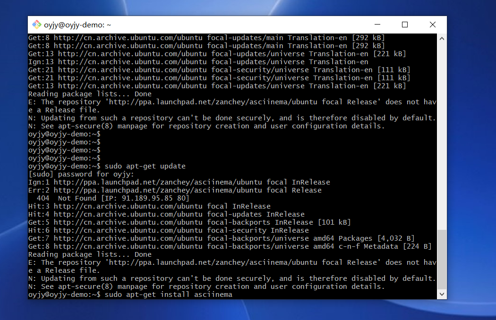
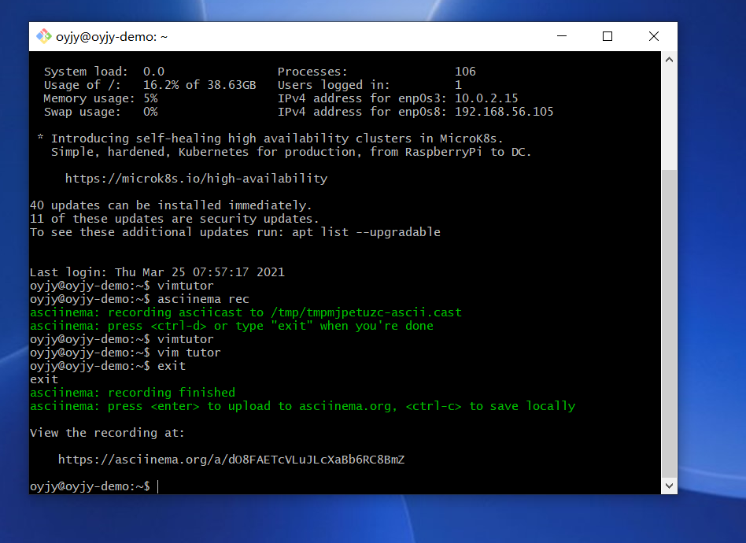

# 学习vimtutor操作并全程录像

## 实验目的

掌握vimtutor操作，熟练使用asciinema录像

## 实验环境

Ubuntu 20.04 Server 64bit

asciinema

## 实验要求

上传本人亲自动手完成的vimtutor操作全程录像

## 实验步骤

### 一、注册asciinema账号并完成asciinema auth
&emsp;注册并登陆asciinema账号,登陆虚拟机，安装asciinema之后完成asciinema auth

```
sudo apt-add-repository ppa:zanchey/asciinema
sudo apt-get update
sudo apt-get install asciinema
asciinema auth
```



### 二、进入vimtutor学习操作并录像

&emsp;asciinema开始录像,打开vimtutor开始学习,exit结束录像

```
asciinema rec #开始录像
vimtutor #进入vimtutor
:q! <ENTER> #退出vimtutor
exit #结束录像
```



[lesson-1.1-1.2](https://asciinema.org/a/o1YaIwQa4lMRbvfDdKpp0QlRM)

[lesson-1.3](https://asciinema.org/a/z41gvjk8uyI6k2PkJrtTG4mvE)

[lesson-1.4](https://asciinema.org/a/TOQngEiUOJCQE1vw852WnllPk)

[lesson-1.5](https://asciinema.org/a/yIWynvi9I7xv5fIewS9h0aN2O)

[lesson-1.6](https://asciinema.org/a/dO8FAETcVLuJLcXaBb6RC8BmZ)

[lesson-2.1-2.2](https://asciinema.org/a/nGr1SGq9B0hhziVWcFicyqEIM)

[lesson-2.3-2.5](https://asciinema.org/a/sSWTU80dDeSP91ZoRJeGnJFy3)

[lesson-2.6-2.7](https://asciinema.org/a/MD0I3ezlKgTZKwE3mF3oOt0CZ)

[lesson-3.1-3.3](https://asciinema.org/a/la2QkUHnTUfynyARqE9f3T1zk)

[lesson-3.4](https://asciinema.org/a/2cHjLKMQ61ZyYgdXmycPtzdKh)

[lesson-4.1-4.3](https://asciinema.org/a/gQGqmCj5MtbaR7NaRwQDU9Qww)

[lesson-4.4](https://asciinema.org/a/ilFkSoTI0y206SqccQmAwMCjK)

[lesson-5.1-5.2](https://asciinema.org/a/0q9FWQalSONKmRP5SxWQ4FBfC)

[lesson-5.3-5.4](https://asciinema.org/a/dLmfRMHz2H90onHefOyAW7pIE)

[lesson-6.1-6.2](https://asciinema.org/a/72UnDoy4FHhaDf23NZ8VTtNVY)

[lesson-6.3-6.4](https://asciinema.org/a/ZSSWnqPw9AgoNaMUWTkuPOBlL)

[lesson-6.5](https://asciinema.org/a/xa9jUmWHb76gzE8HTXFDPtWe6)

[lesson-7.1-7.2](https://asciinema.org/a/MaQWoi92465cqWoeTKmekLIXr)

[lesson-7.3](https://asciinema.org/a/1mwvspqweYrVCo2pZscEWjEqL)

## 问题自查

1.你了解vim有哪几种工作模式？

*命令、插入、底行模式*

2.Normal模式下，从当前行开始，一次向下移动光标10行的操作方法？

```
10j
```

3.如何快速移动到文件开始行和结束行？

```
gg #开始行
G #结束行
```

4.如何快速跳转到文件中的第N行？

```
NG
```

5.Normal模式下，如何删除单个字符、单个单词、从当前光标位置一直删除到行尾、单行、当前行开始向下数N行？

```
x #字符
dw #单词
d$ #行尾
dd #单行
ndd #下数n行
```

6.如何在vim中快速插入N个空行？如何在vim中快速输入80个-？

```
No #前插
NO #后插
80i/a- #80个- 
```

7.如何撤销最近一次编辑操作？

```
u
```

8.如何重做最近一次被撤销的操作？

```
CTRL-R
```

9.vim中如何实现剪切粘贴单个字符？单个单词？单行？

```
v #选中
d #剪切 
p #粘贴
```

10.如何实现相似的复制粘贴操作呢？

```
v #选中
y #复制 
p #粘贴
```

11.为了编辑一段文本你能想到哪几种操作方式（按键序列）？

```
a i o #插入
d #剪切
y #复制
p #粘贴
x dd dw d$ #删除
r #替换
```

12.查看当前正在编辑的文件名的方法？查看当前光标所在行的行号的方法？

```
:f/:e #文件名
CTRL-g #行号
```

13.在文件中进行关键词搜索你会哪些方法？如何设置忽略大小写的情况下进行匹配搜索？如何将匹配的搜索结果进行高亮显示？如何对匹配到的关键词进行批量替换？

```
/or? #关键词
：set ic #忽略大小写
set hls #显示高亮
% s/xxx/yyy/g #批量替换
```

14.在文件中最近编辑过的位置来回快速跳转的方法？

```
CTRL-O #向前跳转
CTRL-I #向后跳转
```

15.如何把光标定位到各种括号的匹配项？例如：找到(, [, or {对应匹配的),], or }

光标指向括号处，输入```
%```

16.在不退出vim的情况下执行一个外部程序的方法？

```
:!<command>
```

17.如何使用vim的内置帮助系统来查询一个内置默认快捷键的使用方法？如何在两个不同的分屏窗口中移动光标？

```
:help <shortcut> #默认快捷键
(CTRL-W)+W #移动光标
```
